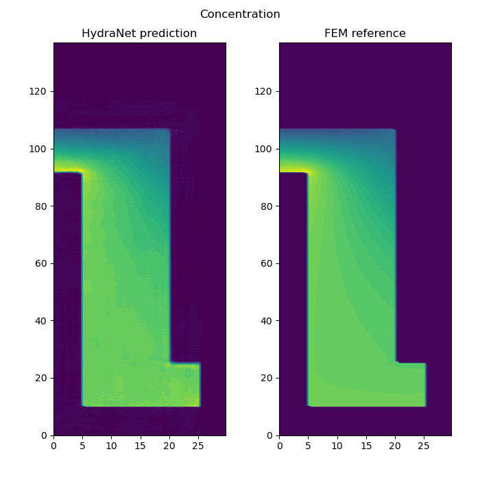

# HydraNet as a surrogate for FEM simulation of Lithium-ion batteries

The code that generates results in paper [A convolution neural network-based surrogate for finite element analysis of multi-physics problems](PAPER_LINK) paper.

## Dataset
---
The data which is used to train and evaluate the HydraNet is generated from the FEM model developed by [Grazioli et. al.](
https://doi.org/10.1016/j.electacta.2018.07.146). 

## Training
--- 
To train the model, adjust parameters at the top of the `scripts/batch_train.py` script. Then run the script. 

The model and metadata is saved in a directory under `output` directory.  

As an example, we have commited a saved model.
Find it at `output/data_percentage/1.0/0.001/simple/boundary_edge_surface/filter_32_64/kernel_7/cnn_20201220_113015`. And accompanying data at `data/processed/boundary_edge_surface_1.0`.

## Evaluation
---
To evaluate the model, adjust parameters at the top of the `scripts/batch_evaluate.py` script. Provide the link to the model that you would like to use for evaluation. You can find the trained models under the `output` directory. Then run the script.

The outputs are predicted solution fields against target solution fields. These outputs are in the parent directory of the model, in a directory named `plots`.